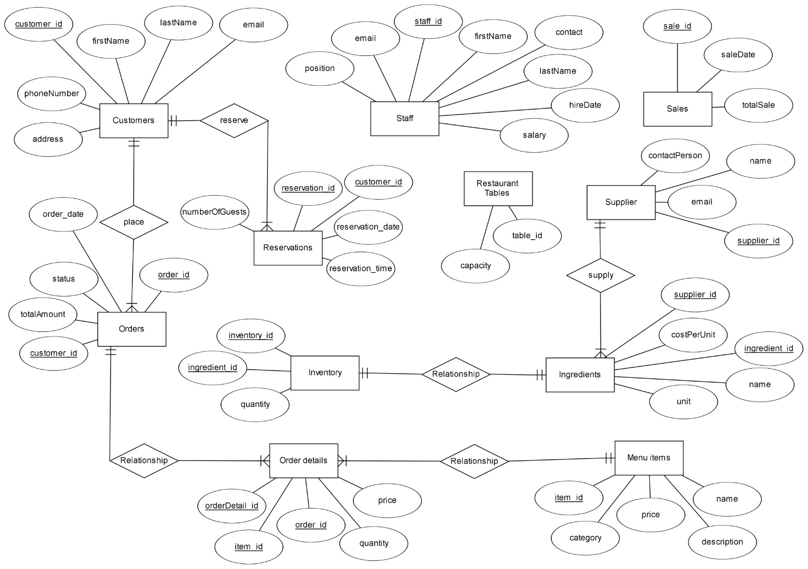
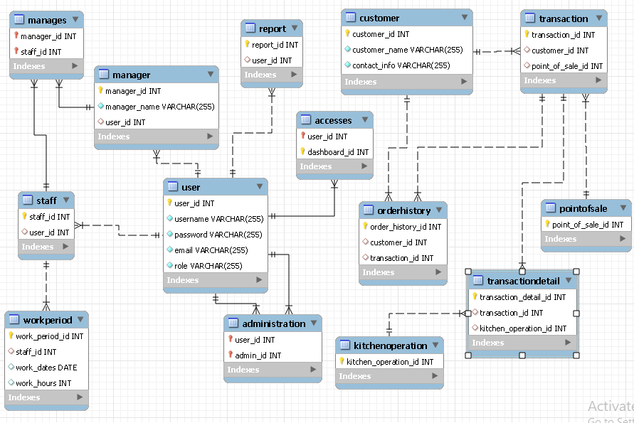

# Restaurant Management System Database Project

This project is a database management system for a restaurant, designed to handle the storage and retrieval of information related to menu items, orders, customers, and other key components of restaurant operations. This README provides a summary of the project's structure, functionality, and usage.

## Project Overview

The Restaurant Management System project is a database-driven solution aimed at managing a restaurant’s daily operations efficiently. The database schema and associated queries allow for streamlined data organization and retrieval, enabling quick access to essential data for inventory, sales, customer management, and more.

## Project Files

- **create.sql**: This file contains SQL commands to create the database tables, indexes, and relationships essential for the system's functionality.
- **insert.sql**: Contains SQL statements for inserting initial data into the database tables.
- **query.sql**: Holds frequently used SQL queries to retrieve data, such as fetching menu items, customer orders, and sales reports.
- **ERD Diagram.jpeg**: A visual representation of the database's Entity-Relationship Diagram (ERD), illustrating the relationships among tables.
- **project_schema.png**: An image showcasing the project's database schema, detailing table structures, attributes, and their relationships.
- **database project presentation.pptx**: A presentation summarizing the project’s objectives, database design, and key functionalities.

## Installation & Setup

1. **Clone the Repository**:
   ```bash
   git clone https://github.com/OPxMirza/Database-project-restaurant-management-system.git
   cd Database-project-restaurant-management-system
   ```

2. **Database Setup**:
   - Open your database client (e.g., MySQL Workbench, pgAdmin).
   - Run `create.sql` to set up the database tables.
   - Run `insert.sql` to populate the tables with initial data.

3. **Running Queries**:
   - Use `query.sql` to execute sample queries and retrieve relevant information from the database.

## Database Design

The design of this database focuses on the core entities required to manage restaurant operations:
- **Customers**: Stores customer details.
- **Orders**: Captures information about each order placed.
- **Menu Items**: Contains details of available menu items.
- **Staff**: Manages information about restaurant employees.

### ERD Diagram



### Database Schema




## Sample Queries

### Join Queries

- **List all orders with customer details**:
    ```sql
    SELECT Orders.order_id, Orders.orderDate, Orders.totalAmount, Customers.firstName, Customers.lastName, Customers.email
    FROM Orders
    JOIN Customers ON Orders.customer_id = Customers.customer_id;
    ```

- **List all order details with item information**:
    ```sql
    SELECT Orders.order_id, MenuItems.Name AS ItemName, OrderDetails.quantity, OrderDetails.price
    FROM OrderDetails
    JOIN Orders ON OrderDetails.order_id = Orders.order_id
    JOIN MenuItems ON OrderDetails.item_id = MenuItems.item_id;
    ```

- **List all customers and their orders (including those who haven’t placed any orders)**:
    ```sql
    SELECT Customers.customer_id, Customers.firstName, Customers.lastName, Orders.order_id, Orders.orderDate
    FROM Customers
    LEFT JOIN Orders ON Customers.customer_id = Orders.customer_id;
    ```

### Correlated Subqueries

- **Find all customers who have placed more than 5 orders**:
    ```sql
    SELECT firstName, lastName, email
    FROM Customers
    WHERE customer_id IN (
        SELECT customer_id
        FROM Orders
        GROUP BY customer_id
        HAVING COUNT(order_id) > 5
    );
    ```

- **List all menu items with a price higher than the average price of all items**:
    ```sql
    SELECT Name, price
    FROM MenuItems
    WHERE price > (SELECT AVG(price) FROM MenuItems);
    ```

### Subqueries

- **Find the total amount of a specific order by `order_id`**:
    ```sql
    SELECT SUM(quantity * price) AS totalAmount
    FROM OrderDetails
    WHERE order_id = 1;
    ```

- **List all suppliers who supply ingredients that cost more than the average cost of all ingredients**:
    ```sql
    SELECT supplier_id, Name, contactPerson, email
    FROM Suppliers
    WHERE supplier_id IN (
        SELECT supplier_id
        FROM Ingredients
        WHERE costPerUnit > (SELECT AVG(costPerUnit) FROM Ingredients)
    );
    ```

- **Find all staff who were hired before any current managers**:
    ```sql
    SELECT firstName, lastName, position
    FROM Staff
    WHERE hireDate < (SELECT MIN(hireDate) FROM Staff WHERE position = 'Manager');
    ```

## Usage

- This project can serve as a starting point for building a fully functional restaurant management application.
- You can modify and expand the `query.sql` file with additional queries based on your needs.
- The database schema and ERD diagram provide a clear guide to the structure and relationships of the data.
